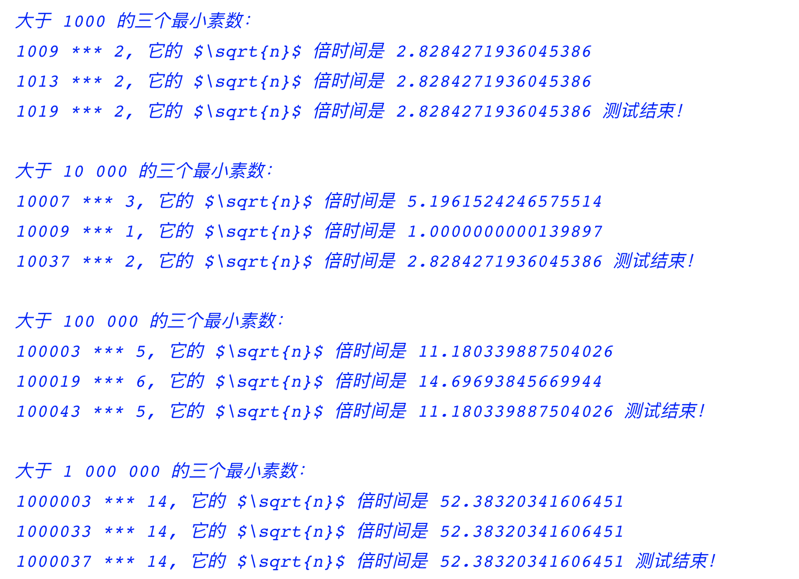
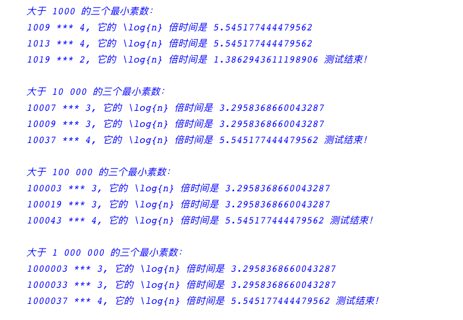

# 1.24

## 练习 1.24： 修改练习1.22的 timed-prime-test 过程，让它使用 fast-prime? （费马方法），并检查你在该练习中找出的12个素数。因为费马检查具有$$\Theta(log\thinspace n)$$的增长速度，对接近 1 000 000 的素数检查与接近 1000 的素数检查作对期望时间之间的比较有怎样的预期？你的数据确实表明了这一预期吗？你能解释所发现的任何不符合预期的地方吗？

<link rel="stylesheet" type="text/css" href="../../coding-js/deps/codemirror/lib/codemirror.css" />
<link rel="stylesheet" type="text/css" href="../../coding-js/coding.css" />
<link rel="stylesheet" type="text/css" href="../../coding-js/base.css" />

### 先测试一下 fast-prime? 的允许效果

(define (fast-prime? n times)
    (cond ((= times 0) true)
        ((fermat-test n) (fast-prime? n (- times 1)))
        (else false)
    )
)
(define (fermat-test n)
    (define (try-it a)
        (= (expmod a n n) a)
    )

    (try-it (+ 1 (random (- n 1))))
)
(define (expmod base exp m)
    (cond ((= exp 0) 1)
        ((even? exp)
            (remainder (square (expmod base (/ exp 2) m))
            m)
        )
        (else
            (remainder (* base (expmod base (- exp 1) m))
            m)
        )
    )
)

(define (timed-prime-test n)
    (newline)
    (display n)
    (start-prime-test n (runtime)))

(define (start-prime-test n start-time)
    (if (fast-prime? n 5)
        (report-prime (- (runtime) start-time)) (display " 不是素数！")))

(define (report-prime elapsed-time)
    (display " *** ")
    (display elapsed-time))

(define (square x) (* x x))

(timed-prime-test 7)
(timed-prime-test 14)

### 分别找出大于 1 000、10 000、100 000、1 000 000 的三个最小素数。

(define (fast-prime? n times)
    (cond ((= times 0) true)
        ((fermat-test n) (fast-prime? n (- times 1)))
        (else false)
    )
)
(define (fermat-test n)
    (define (try-it a)
        (= (expmod a n n) a)
    )

    (try-it (+ 1 (random (- n 1))))
)
(define (expmod base exp m)
    (cond ((= exp 0) 1)
        ((even? exp)
            (remainder (square (expmod base (/ exp 2) m))
            m)
        )
        (else
            (remainder (* base (expmod base (- exp 1) m))
            m)
        )
    )
)
(define (fast-prime? n times)
    (cond ((= times 0) true)
        ((fermat-test n) (fast-prime? n (- times 1)))
        (else false)
    )
)
(define (fermat-test n)
    (define (try-it a)
        (= (expmod a n n) a)
    )

    (try-it (+ 1 (random (- n 1))))
)
(define (expmod base exp m)
    (cond ((= exp 0) 1)
        ((even? exp)
            (remainder (square (expmod base (/ exp 2) m))
            m)
        )
        (else
            (remainder (* base (expmod base (- exp 1) m))
            m)
        )
    )
)
(define (timed-prime-test n)
    (start-prime-test n (runtime)))

(define (start-prime-test n start-time)
    (if (fast-prime? n 5)
        (report-prime n (- (runtime) start-time)) #f))

(define (square x) (* x x))

(define (report-prime n elapsed-time)
    (newline)
    (display n)
    (display " *** ")
    (display elapsed-time)
    (display ", 它的 \\log{n} 倍时间是 ")
    (display (* elapsed-time (log elapsed-time)))
)

(define (timed-prime-test-between n1 n2 found)
    (if (timed-prime-test n1)
        (if (or (> found 1) (> n1 n2))
            (display " 测试结束！ ")
            (timed-prime-test-between (+ n1 1) n2 (+ found 1))
        )
        (if (> n1 n2)
            (display " 测试结束！ ")
            (timed-prime-test-between (+ n1 1) n2 found)
        )
    )
)

(newline)
(display "大于 1000 的三个最小素数：")
(timed-prime-test-between 1001 9999 0)
(newline)

(newline)
(display "大于 10 000 的三个最小素数：")
(timed-prime-test-between 10001 99999 0)
(newline)

(newline)
(display "大于 100 000 的三个最小素数：")
(timed-prime-test-between 100001 999999 0)
(newline)

(newline)
(display "大于 1 000 000 的三个最小素数：")
(timed-prime-test-between 1000001 9999999 0)
(newline)

---

以下是一次测试结果，在和 1.22 测试用过的同样的机器上的对比：

| 1.22 | 1.24 |
| --- | --- |
|||

由于费马检查具有$|\Theta(log\thinspace n)|$的增长速度，所以，对于接近 1 000 000 的素数检查与接近 1000 的素数检查的耗时差异应该是极小的，而且实验结果也表现了这一点，无论是多大的数字附近的素数检查，其耗时都稳定在 3 毫秒左右。

有意思的是，对于很小的数附近的素数检查，比如 7，其耗时比寻找因子方法更长。这大概是因为费马测试用到了指数计算，比寻找因子方法中的减法更慢一些。
