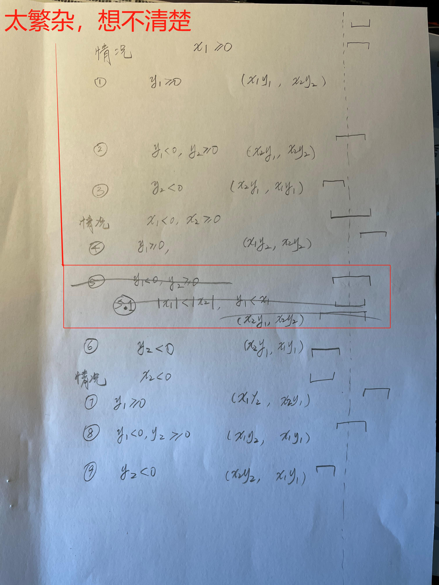

# 2.11

## 练习 2.11 在看了这些东西之后，Ben 又说出了下面这段有些神秘的话：“通过监测区间的端点，有可能将 mul-interval 分解为9种情况，每种情况中所需的乘法都不超过两次。”请根据 Ben 的建议重写这个过程。

---

```eval-scheme
(define (make-interval a b) (cons a b))
(define upper-bound cdr)
(define lower-bound car)
(define (add-interval x y) 
    (make-interval (+ (lower-bound x) (lower-bound y))
                    (+ (upper-bound x) (upper-bound y))))
(define (sub-interval x y) (add-interval x (make-interval (- 0 (upper-bound y)) (- 0 (lower-bound y)))))
(define (subtract-interval x y)
    (define p1 (- (lower-bound x) (lower-bound y)))
    (define p2 (- (lower-bound x) (upper-bound y)))
    (define p3 (- (upper-bound x) (lower-bound y)))
    (define p4 (- (upper-bound x) (upper-bound y)))
    
    (make-interval (min p1 p2 p3 p4) (max p1 p2 p3 p4)))

(define (mul-interval x y)
    (define p1 (* (lower-bound x) (lower-bound y)))
    (define p2 (* (lower-bound x) (upper-bound y)))
    (define p3 (* (upper-bound x) (lower-bound y)))
    (define p4 (* (upper-bound x) (upper-bound y)))

    (make-interval (min p1 p2 p3 p4) (max p1 p2 p3 p4))
)

(define int1 (make-interval 2 4))
(define int2 (make-interval 3 6))
(mul-interval int1 int2)
```

通过观察以上实现，发现结果区间是由4个端点的最小值和最大值组合而成，但是使用了4次乘法。要分成9种情况来讨论，很自然地是按照区间在0右边、左边和横跨0点来分类：

1. x 在0点右边 $|x_1 \ge 0|$
    1. y 在0点右边，显然，最小值 = $| x_1 \cdot y_1|$，最大值 = $|x_2 \cdot y_2|$
    2. y 在0点左边，显然，最小值 = $| x_2 \cdot y_1|$，最大值 = $|x_1 \cdot y_1|$
    3. y 横跨 0 点，显然，最小值 = $|x_2 \cdot y_1|$，最大值 = $|x_2 \cdot y_2|$

2. x 在0点左边 $|x_2 \le 0|$
    1. y 在0点右边，显然，最小值 = $|x_1 \cdot y_2|$，最大值 = $|x_2 \cdot y_1|$
    2. y 在0点左边，显然，最小值 = $|x_2 \cdot y_2|$，最大值 = $|x_1 \cdot y_1|$
    3. y 横跨 0 点，显然，最小值 = $|x_1 \cdot y_2|$，最大值 = $|x_1 \cdot y_1|$

3. x 横跨0点 $|x_1 < 0 或者 x_2 > 0|$
    1. y 在0点右边，显然，最小值 = $|x_1 \cdot y_2|$，最大值 = $|x_2 \cdot y_2|$
    2. y 在0点左边，显然，最小值 = $|x_2 \cdot y_1|$，最大值 = $|x_1 \cdot y_1|$
    3. y 横跨 0 点，这个想了很久，发现情况特别繁杂，远远超出了对整个情况分成 9 种情况的类别，原因是想避免使用 min、max。最终放弃，还是无脑计算后，使用 min max 来得简单，但导致合起来这个分支还是有 4 次乘法，似乎没有满足题目要求。
    由于x和y都横跨0点，所以最小值肯定不大于0，因为要么是 $|x_1 \cdot y_2|$，要么是$|x_2 \cdot y_1|$，看谁更小。同理，最大值肯定不小于0，要么是 $| x_1 \cdot y_1 |$，要么是 $|x_2 \cdot y_2|$，看谁更大。


```eval-scheme
(define (multiply-interval x y)
    (define x1 (lower-bound x))
    (define x2 (upper-bound x))
    (define y1 (lower-bound y))
    (define y2 (upper-bound y))

    (cond 
        ((>= x1 0)
            (cond
                ((>= y1 0) (make-interval (* x1 y1) (* x2 y2)))
                ((<= y2 0) (make-interval (* x2 y1) (* x1 y1)))
                (else (make-interval (* x2 y1) (* x2 y2)))
            )
        )
        ((<= x2 0)
            (cond
                ((>= y1 0) (make-interval (* x1 y2) (* x2 y1)))
                ((<= y2 0) (make-interval (* x2 y2) (* x1 y1)))
                (else (make-interval (* x1 y2) (* x1 y1)))
            )
        )
        (else
            (cond
                ((>= y1 0) (make-interval (* x1 y2) (* x2 y2)))
                ((<= y2 0) (make-interval (* x2 y1) (* x1 y1)))
                (else (make-interval (min (* x1 y2) (* x2 y1)) (max (* x1 y1) (* x2 y2))))
            )
        )
    )
)

(multiply-interval int1 int2)
```



## JavaScript 版本的区间算术

- https://github.com/Jeff-Tian/JavaScriptIntervalArithmetic