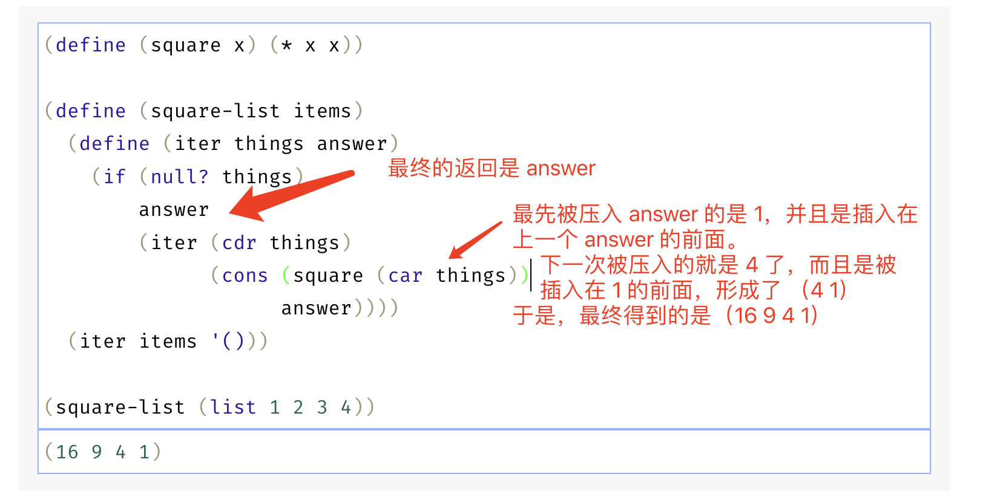

# 2.22

## 练习 2.22 Louis Reasoner试图重写练习2.21的第一个square-list过程，希望使它能生成一个迭代计算过程：

```
(define (square-list items)
    (define (iter things answer)
        (if (null? things)
            answer
            (iter (cdr things)
                    (cons (square (car things))
                            answer))))
    (iter items nil))
```

但是很不幸，在按这种方式定义出的square-list产生出的结果表中，元素的顺序正好与我们所需要的相反。为什么？

Louis又试着修正其程序，交换了 cons 的参数：

```
(define (square-list items)
    (define (iter things answer)
        (if (null? things)
            answer
            (iter (cdr things)
                (cons answer 
                    (square (cdr things))))))
    (iter items nil))
```
但还是不行。请解释为什么。

---

先跑一下Louis的第一个实现：
```eval-scheme
(define (square x) (* x x))

(define (square-list items)
    (define (iter things answer)
        (if (null? things)
            answer
            (iter (cdr things)
                    (cons (square (car things))
                            answer))))
    (iter items '()))

(square-list (list 1 2 3 4))
```
解释如图：



再来跑一下 Louis 的第二个实现：


```eval-scheme
(define (square-list-2 items)
    (define (iter things answer)
        (if (null? things)
            answer
            (iter (cdr things)
                (cons answer 
                    (square (cdr things))))))
    (iter items '()))

(square-list-2 (list 1 2 3 4))
```

可见，虽然修改参数的顺序的意图是对的，但是导致了 (cdr things) 是一个 list 不能传递给 square 过程。第一个实现中的 (car things) 是一个数，是可以传递的。

