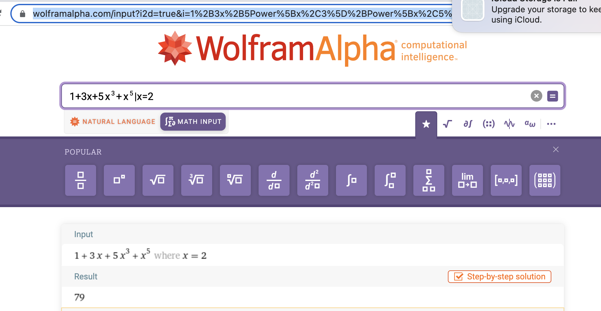

# 2.34

## 练习 2.34 对于x的某个给定值，求出一个多项式在x值，也可以形式化为一种累积。假定需要求下面多项式的值：

$$
a_n x^n + a_{n-1} x^{n-1} + \cdots + a_1 x + a_0
$$

采用著名的Horner规则，可以构造出下面的计算：

$$
(\cdots (a_nx + a_{n-1})x + \cdots + a_1) x + a_0
$$

换名话说，我们可以从a<sub>n</sub>开始，乘以x，再加上$$a_{n-1}$$，乘以x，如此下去，直到处理完$|a_0|$。请填充下面的模板，做出一个复用Horner规则求多项式值的过程。假定多项式的系数安排在一个序列里，从$|a_0|$直至$|a_n|$。

```
(define (horner-eval x coefficient-sequence)
    (accumulate (lambda (this-coeff higher-terms) <??>)
                0
                coefficient-sequence))
```

例如，为了计算$|1+3x + 5x^3 + x^5|$在x=2的值，你需要求值：

```
(horner-eval 2 (list 1 3 0 5 0 1))
```

---

首先，定义 accumulate

```eval-scheme
(define (accumulate op initial sequence)
    (if (null? sequence)
        initial
        (op (car sequence)
            (accumulate op initial (cdr sequence))) 
    )
)
```

```eval-scheme

(define (horner-eval x coefficient-sequence)
    (accumulate (lambda (this-coeff higher-terms) (+ this-coeff (* higher-terms x)))
                0
                coefficient-sequence))

(horner-eval 2 (list 1 3 0 5 0 1))
```

[对比](https://www.wolframalpha.com/input?i2d=true&i=1%2B3x%2B5Power%5Bx%2C3%5D%2BPower%5Bx%2C5%5D%7Cx%3D2)：

