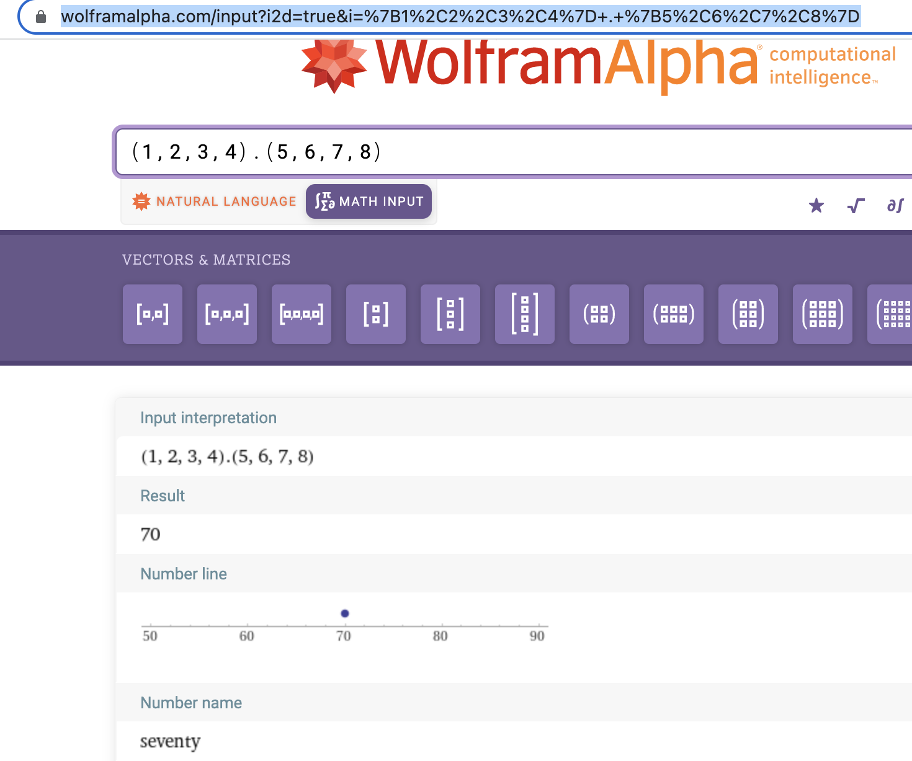

# 2.37

## 练习 2.37 假定我们将向量 v=(v<sub>i</sub>) 表示为数的序列，将矩阵m=(m<sub>ij</sub>)表示为向量（矩阵行）的序列。例如，矩阵：

$$
\left[ {\begin{array}{cc}
    1 & 2 & 3 & 4 \\
    4 & 5 & 6 & 6 \\
    6 & 7 & 8 & 9 
  \end{array} } 
\right]
$$

用序列((1 2 3 4) (4 5 6 6) (6 7 8 9))表示。对于这种表示，我们可以用序列操作简洁地表达基本的矩阵与向量运算。这些运算（任何有关矩阵代数的书里都有描述）如下：

(dot-product v w)       返回和 $|\sum_i v_i w_i|$ ；

(matrix-*-vector m v)   返回向量 t，其中 $$ t_{i} = \sum_j m_{ij} v_j $$ ；

(matrix-*-matrix m n)   返回矩阵 p，其中 $$ p_{ij} = \sum_k m_{ik} n_{kj} $$ ；

(transpose m)           返回矩阵 n，其中 $$ n_{ij}=m_{ji} $$ 。

我们可以将点积 (dot product) 定义为：

```
(define (dot-product v w)
    (accumulate + 0 (map * v w)))
```

请填充下面过程里缺失的表达式，它们计算出其他的矩阵运算结果（过程 accumulate-n 在练习 [2.36](./2.36) 中定义）。

```
(define (matrix-*-vector m v)
    (map <??> m))

(define (transpose mat)
    (accumulate-n <??> <??> mat))

(define (matrix-*-matrix m n)
    (let ((cols (transpose n)))
        (map <??> m)))
```

--- 


首先，定义 accumulate

```eval-scheme
(define (accumulate op initial sequence)
    (if (null? sequence)
        initial
        (op (car sequence)
            (accumulate op initial (cdr sequence))) 
    )
)
```


```eval-scheme
(define (dot-product v w)
    (accumulate + 0 (map * v w)))

(dot-product (list 1 2 3 4) (list 5 6 7 8))
```

[对比](https://www.wolframalpha.com/input?i2d=true&i=%7B1%2C2%2C3%2C4%7D+.+%7B5%2C6%2C7%2C8%7D): 




```eval-scheme
(define (matrix-*-vector m v)
    (map (lambda (m_i) (dot-product m_i v)) m))

(define m (list (list 1 2 3 4) (list 4 5 6 6) (list 6 7 8 9)))
(define v (list 1 2 3 4)) 

(matrix-*-vector m v)
```

[对比](https://www.wolframalpha.com/input?i=matrix+multiplication&assumption=%7B%22F%22%2C+%22MatricesOperations%22%2C+%22theMatrix2%22%7D+-%3E%22%281%2C2%2C3%2C4%29%22&assumption=%7B%22F%22%2C+%22MatricesOperations%22%2C+%22theMatrix1%22%7D+-%3E%22%7B%7B1%2C2%2C3%2C+4%7D%2C%7B4%2C+5%2C+6%2C+6%7D%2C%7B6%2C+7%2C+8%2C+9%7D%7D%22&assumption=%7B%22C%22%2C+%22matrix+multiplication%22%7D+-%3E+%7B%22Calculator%22%7D)：

 

然后，再定义 accumulate-n

```eval-scheme
(define (accumulate-n op init seqs)
    (if (null? (car seqs))
        '()
        (cons (accumulate op init (map car seqs))
                (accumulate-n op init (map cdr seqs)))))

(define s (list (list 1 2 3) (list 4 5 6) (list 7 8 9) (list 10 11 12)))
(accumulate-n + 0 s)
```

```eval-scheme
(define (transpose mat)
    (accumulate-n cons '() mat))

(transpose m)
```

```eval-scheme
(define (matrix-*-matrix m n)
    (let ((cols (transpose n)))
        (map (lambda (v) (matrix-*-vector cols v)) m))) 

(define n (transpose m))

(matrix-*-matrix m n)
```

[对比](https://www.wolframalpha.com/input?i=matrix+multiplication&assumption=%7B%22F%22%2C+%22MatricesOperations%22%2C+%22theMatrix2%22%7D+-%3E%22transpose%28%7B%7B1%2C2%2C3%2C+4%7D%2C%7B4%2C+5%2C+6%2C+6%7D%2C%7B6%2C+7%2C+8%2C+9%7D%7D%29%22&assumption=%7B%22F%22%2C+%22MatricesOperations%22%2C+%22theMatrix1%22%7D+-%3E%22%7B%7B1%2C2%2C3%2C+4%7D%2C%7B4%2C+5%2C+6%2C+6%7D%2C%7B6%2C+7%2C+8%2C+9%7D%7D%22&assumption=%7B%22C%22%2C+%22matrix+multiplication%22%7D+-%3E+%7B%22Calculator%22%7D)：

