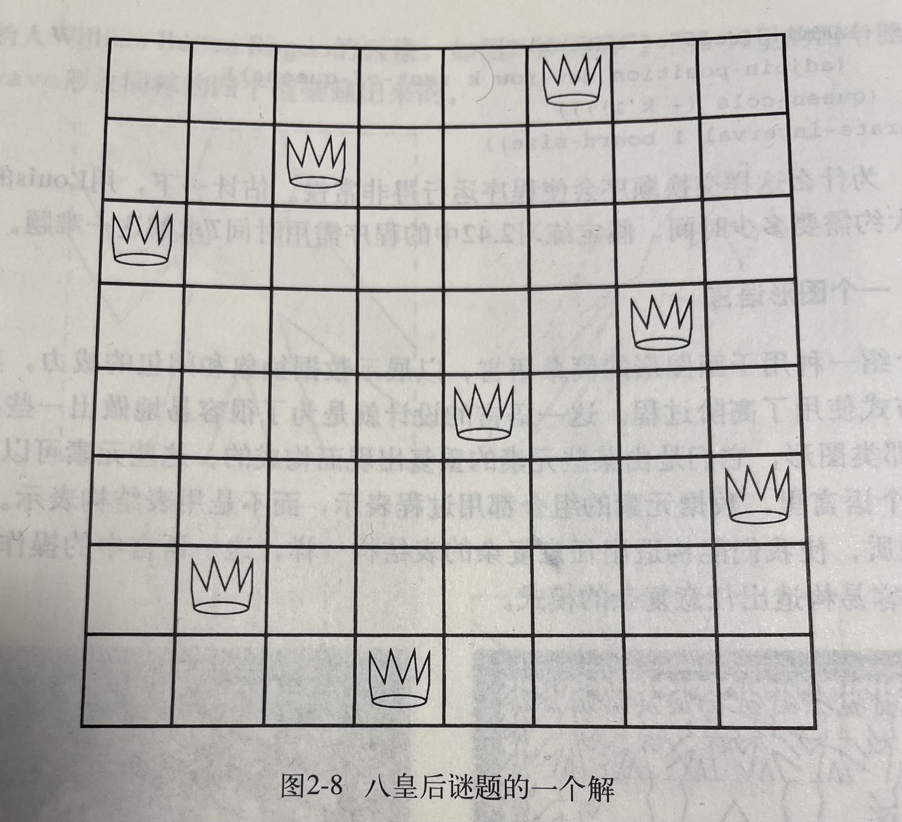

# 2.42

## 练习 2.42 “八皇后谜题”问的是怎样将八个皇后摆在国际象棋盘上，使得任意一个皇后都不能攻击另一个皇后（也就是说，任意两个皇后都不在同一行、同一列或者同一对角线上）。一个可能的解如图2-8所示。解决这一谜题的一种方法按一个方向处理棋盘，每次在第一列里放一个皇后。如果现在已经放好了k-1个皇后，第k个皇后就必须放在不会被已民在棋盘上的任何皇后攻击的位置上。我们可以递归地描述这一过程：假定我们已经生成了在棋盘的前k-1列中放置k-1个皇后的所有可能方式，现在需要的就是对于其中的每种方式，生成出将下一个皇后放在第k列中每一行的扩充集合。而后过滤它们，只留下能使位于第k列的皇后与其他皇后相安无事的那些扩充。这样就能产生出将k个皇后放置在前k列的所有格局的序列，继续这一过程，我们将能产生出这一谜题的所有解，而不是一个解。

## 将这一解法实现为一个过程queens，令它返回在n x n棋盘上放n个皇后的所有解的序列。queens内部的过程queen-cols，返回在棋盘的前k列中放皇后的所有格局的序列。



```
(define (queens board-size)
    (define (queen-cols k)
        (if (= k 0)
            (list empty-board)
            (filter
                (lambda (positions) (safe? k positions))
                (flatmap
                    (lambda (rest-of-queens)
                        (map (lambda (new-row)
                            (adjoin-position new-row k rest-of-queens))
                        (enumerate-interval 1 board-size)))
                    (queen-cols (- k 1))))))
    (queen-cols board-size))
```

## 这个过程里的 rest-of-queens 是在前k-1列放置k-1个皇后的一种方式，new-row是在第k列放置所考虑的行编号。请完成这一程序，为此需要实现一种棋盘格局集合的表示方式；还要实现过程adjoin-position，它将一个新的行列格局加入一个格局集合；empty-board，它表示空的格局集合。你还需要写出过程safe?，它能确定在一个格局中，在第k列的皇后相对于其他列的皇后是否为安全的（请注意，我们只需要检查新皇后是否安全——其他皇后已经保证相安无事了）。

---

首先，需要实现一种棋盘格局集合的表示方式。如同矩阵一样，采用嵌套 list 来表示，并且用 1 表示有皇后，用 0 表示没有皇后。比如，对于图2-8的图，对于的表示如下：

```eval-scheme
(define eight-by-eight
    (list
        (list 0 0 0 0 0 1 0 0)
        (list 0 0 1 0 0 0 0 0) 
        (list 1 0 0 0 0 0 0 0)
        (list 0 0 0 0 0 0 1 0)
        (list 0 0 0 0 1 0 0 0)
        (list 0 0 0 0 0 0 0 1)
        (list 0 1 0 0 0 0 0 0)
        (list 0 0 0 1 0 0 0 0)
    )
)
```

然后，定义 accumulate

```eval-scheme
(define (accumulate op initial sequence)
    (if (null? sequence)
        initial
        (op (car sequence)
            (accumulate op initial (cdr sequence))) 
    )
)
```

对于棋盘上已经放置了 k-1 个皇后的前 k-1 个列，再在第 k 列的 new-row 处再置一个皇后，就是将该位置的元素设置为 1：

```eval-scheme
(define (enumerate-interval low high)
    (if (> low high)
        '()
        (cons low (enumerate-interval (+ low 1) high))))
```

```eval-scheme
(define (adjoin-position new-row k rest-of-queens)
    (map
        (lambda (i) 
            (map
                (lambda (j) 
                    (if (and (= new-row i) (= k j)) 
                        1
                        (list-ref (list-ref rest-of-queens (- i 1)) (- j 1)) 
                    )
                )
                (enumerate-interval 1 (max 1 (length rest-of-queens)))
            )
        )
        (enumerate-interval 1 (max 1 (length rest-of-queens)))
    )
)

(adjoin-position 8 8 eight-by-eight)
```

空的格局集合可以定义为全0的 list：

```eval-scheme
(define 
    (make-empty-board board-size)
    (map
        (lambda (i) 
            (map 
                (lambda (j) 0)
                (enumerate-interval 1 board-size)
            )
        )
        (enumerate-interval 1 board-size)
    )
)

(make-empty-board 2)
```

要定义 safe?，可以考虑对第 k 列，看其按列的和是否不大于1，然后看相关行的和是否不大于1，以及两个对角线方向的和是否均不大于1。

由于是向最后的一列再添加一个皇后，因此列上的检查可以省略。所以要检查的是所有行，以及左上对角所有位置和左下对角所有位置。其他位置已经不用检查了。

```eval-scheme
(define (row-safe? positions)
    (=  1 
        (accumulate * 1 
            (map
                (lambda (row) 
                    (if (<= (accumulate + 0 row) 1) 
                        1 
                        0
                    )
                )
                positions
            )
        )
    )
)

(row-safe? eight-by-eight)
```

```eval-scheme
(define (get-element positions i j)
    (list-ref 
        (list-ref positions (- i 1))
        (- j 1))
)

(get-element eight-by-eight 3 3 )
```

```eval-scheme
(define (upper-left-safe? k positions)
    (accumulate (lambda (x y) (and x y)) #t (map
        (lambda (i) 
            (<= (accumulate + 0 (map
                (lambda (j)
                    (get-element positions (- (+ i j) k) j)
                )
                (reverse 
                    (enumerate-interval 
                        (max 
                            1 
                            (+ (- k i) 1)
                        ) 
                        k
                    )
                ) 
            )) 1 )
        )
        
        (enumerate-interval 1 (length positions))
    )) 
)  

(upper-left-safe? 2 eight-by-eight)
```

```eval-scheme
(define (lower-left-safe? k positions)
    (accumulate (lambda (x y) (and x y)) #t (map
        (lambda (i) 
            (<= (accumulate + 0 (map
                (lambda (j) (get-element positions (+ i (- k j)) j))  
                (reverse (enumerate-interval 
                    (max 1 (- k (- (length positions) i))) 
                    k  
                ))
            )) 1)
        )
        (enumerate-interval 1 (length positions))
    ))
)

(lower-left-safe? 3 eight-by-eight) 
```

safe? 定义如下：

```eval-scheme
(define (safe? k positions)
    (and 
        (row-safe? positions)
        (upper-left-safe? k positions)
        (lower-left-safe? k positions)
    )
)

(safe? 8 eight-by-eight)
```

最后，定义一下 queens

```eval-scheme
(define (flatmap proc seq)
    (accumulate append '()  (map proc seq)))

(define (queens board-size)
    (define empty-board 
        (make-empty-board board-size)
    )
    
    (define (queen-cols k)
        (if (= k 0)
            (list empty-board)
            (filter
                (lambda (positions) (safe? k positions))
                (flatmap
                    (lambda (rest-of-queens)
                        (map (lambda (new-row)
                            (adjoin-position new-row k rest-of-queens))
                        (enumerate-interval 1 board-size)))
                    (queen-cols (- k 1))))))
    (queen-cols board-size))

(queens 5) 
```
