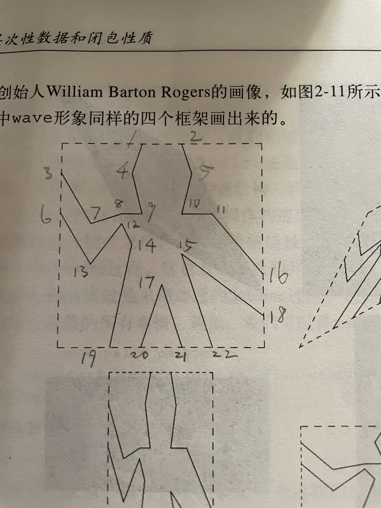

# 2.49

## 练习 2.49 利用segments->painter定义下面的基本画家：

a) 画出给定框架边界的画家

b) 通过连接框架两对角画出一个大叉子的画家。

c) 通过连接框架各边的中心画出一个菱形的画家。

d) 画家 wave。

---

### a)

先用 js 来直观地体验一下，后面再将 js 实现翻译成 scheme。

先使用 js 定义一下 segment 的构造函数，以及其相应的选择函数：

```eval-js
cons = (x, y) => [x, y];
car = (z) => z[0];
cdr = (z) => z[1];

makeVect = cons;
xCorVect = car;
yCorVect = cdr;

makeSegment = cons;
startSegment = car;
endSegment = cdr;

o = makeVect(0, 0);
e1 = makeVect(300, 0);
e2 = makeVect(0, 150); 

s = makeSegment(makeVect(1, 0), makeVect(0, 1)); 
console.log('s = ', s);

console.log(startSegment(s));
console.log(endSegment(s));
```

接着，定义 frame：

```eval-js
makeFrame = (origin, edge1, edge2) => {
    return [origin, edge1, edge2];
};

originFrame = (frame) => frame[0];
edge1Frame = (frame) => frame[1];
edge2Frame = (frame) => frame[2];

addVect = (v1, v2) => makeVect(xCorVect(v1) + xCorVect(v2), yCorVect(v1) + yCorVect(v2));
scaleVect = (s, v) => makeVect(s * xCorVect(v), s * yCorVect(v));

frameCoordMap = (frame) => {
    return (v) => {
        return addVect(
            originFrame(frame),
            addVect(
                scaleVect(
                    xCorVect(v),
                    edge1Frame(frame)
                ),
                scaleVect(
                    yCorVect(v),
                    edge2Frame(frame)
                )
            )
        );
    };
}

f = makeFrame(o, e1, e2);
const m = frameCoordMap(f);
console.log('start = ', m(startSegment(s)));  
console.log('end = ', m(endSegment(s)));
```

然后，定义 segmentsPainter，并运行一个 segmentsPainter 实例看看：

<canvas id="a-segments"></canvas>

```eval-js
drawLine = (v1, v2) => {
    return (ctx) => {
        ctx.beginPath();
        ctx.moveTo(xCorVect(v1), yCorVect(v1));
        ctx.lineTo(xCorVect(v2), yCorVect(v2));
        ctx.stroke();
    }
};

segmentsPainter = (segmentList) => {
    return (frame) => (ctx) => {
        segmentList.forEach((segment) => {
            drawLine(
                (frameCoordMap(frame))(startSegment(segment)),
                (frameCoordMap(frame))(endSegment(segment))
            )(ctx);
        });
    }
}

applyToCanvas = (painter, canvasSelector) => {
    const canvas = document.querySelector(canvasSelector);
    const ctx = canvas.getContext('2d');

    ctx.clearRect(0, 0, canvas.width, canvas.height); 

    painter(ctx);
}

const s2 = makeSegment(
    makeVect(0, 0),
    makeVect(1, 1)
);

applyToCanvas(segmentsPainter([s, s2])(f), '#a-segments');
```

现在，让我们画出这个框架边界：

<canvas id="a-border"></canvas>

```eval-js
framePainter = frame => {
    const corner1 = makeVect(0, 0);
    const corner2 = makeVect(1, 0);
    const corner3 = makeVect(1, 1);
    const corner4 = makeVect(0, 1); 

    return segmentsPainter([
        makeSegment(corner1, corner2),
        makeSegment(corner2, corner3),
        makeSegment(corner3, corner4),
        makeSegment(corner4, corner1)
    ])(frame); 
};

applyToCanvas(framePainter(f), '#a-border');
```

现在，将这个画出框架的画家，翻译成 scheme：

```eval-scheme
(define (frame->painter frame)
    ((segments->painter
        (list
            (make-segment (make-vect 0 0) (make-vect 1 0))
            (make-segment (make-vect 1 0) (make-vect 1 1))
            (make-segment (make-vect 1 1) (make-vect 0 1))
            (make-segment (make-vect 0 1) (make-vect 0 0))
        )
    ) frame)
)
```

### b)

<canvas id="fork-canvas"></canvas>

```eval-js
const forkPainter = (frame) => {
    const corner1 = makeVect(0, 0);
    const corner2 = makeVect(1, 0);
    const corner3 = makeVect(1, 1);
    const corner4 = makeVect(0, 1); 

    const s1 = makeSegment(corner1, corner3);
    const s2 = makeSegment(corner2, corner4);

    return segmentsPainter([s1, s2])(frame); 
};

applyToCanvas(forkPainter(f), '#fork-canvas');
```

将大叉子画家翻译成 Scheme：

```eval-scheme
(define (fork-painter frame) 
    ((segments-painter 
        (list
            (make-segment (make-vect 0 0) (make-vect 1 1))
            (make-segment (make-vect 0 1) (make-vect 1 0))
        )
    ) frame)
)
```

### c

<canvas id="diamond-canvas"></canvas>

```eval-js
diamondPainter = (frame) => {
    const vTop = makeVect(0.5, 0);
    const vRight = makeVect(1, 0.5);
    const vBottom = makeVect(0.5, 1);
    const vLeft = makeVect(0, 0.5);

    const s1 = makeSegment(vTop, vRight);
    const s2 = makeSegment(vRight, vBottom);
    const s3 = makeSegment(vBottom, vLeft);
    const s4 = makeSegment(vLeft, vTop); 

    return segmentsPainter([s1, s2, s3, s4])(frame); 
};

applyToCanvas(diamondPainter(f), '#diamond-canvas');
```

将以上 js 代码翻译成 Scheme 代码：

```eval-scheme
(define (diamond->painter frame) 
    ((segments->painter
        (make-segment (make-vect 0.5 0) (make-vect 1 0.5))
        (make-segment (make-vect 1 0.5) (make-vect 0.5 1))
        (make-segment (make-vect 0.5 1) (make-vect 0 0.5))
        (make-segment (make-vect 0 0.5) (make-vect 0.5 0))
    ) frame)
)
```

### d

wave 的点线比较多，为了画出来，先标记一下所有的点，一共是22个。再连点成线即可。



Scheme 省略，没有新鲜东西，只是比较繁琐而已。

<canvas id="wave-canvas"></canvas>

```eval-js
wavePainter = (frame) => {
    const v1 = makeVect(0.4, 0);
    const v2 = makeVect(0.6, 0);
    const v3 = makeVect(0, 0.2);
    const v4 = makeVect(0.3, 0.2);
    const v5 = makeVect(0.7, 0.2);
    const v6 = makeVect(0, 0.4);
    const v7 = makeVect(0.2, 0.4);
    const v8 = makeVect(0.3, 0.35);
    const v9 = makeVect(0.42, 0.4);
    const v10 = makeVect(0.6, 0.4);
    const v11 = makeVect(0.8, 0.4);
    const v12 = makeVect(0.3, 0.4);
    const v13 = makeVect(0.2, 0.55);
    const v14 = makeVect(0.31, 0.5);
    const v15 = makeVect(0.6, 0.51);
    const v16 = makeVect(1, 0.7);
    const v17 = makeVect(0.5, 0.8);
    const v18 = makeVect(1, 0.85);
    const v19 = makeVect(0.35, 1);
    const v20 = makeVect(0.4, 1);
    const v21 = makeVect(0.6, 1);
    const v22 = makeVect(0.7, 1);

    return segmentsPainter([
        makeSegment(v1, v4),
        makeSegment(v2, v5),
        makeSegment(v3, v7), 
        makeSegment(v7, v8),
        makeSegment(v8, v9),
        makeSegment(v9, v4),
        makeSegment(v10, v5),
        makeSegment(v10, v11),
        makeSegment(v6, v13),
        makeSegment(v13, v12),
        makeSegment(v12, v14),
        makeSegment(v16, v11),
        makeSegment(v18, v15),
        makeSegment(v19, v14),
        makeSegment(v20, v17),
        makeSegment(v21, v17),
        makeSegment(v22, v15),
    ])(frame); 
}

applyToCanvas(wavePainter(f), '#wave-canvas');
```