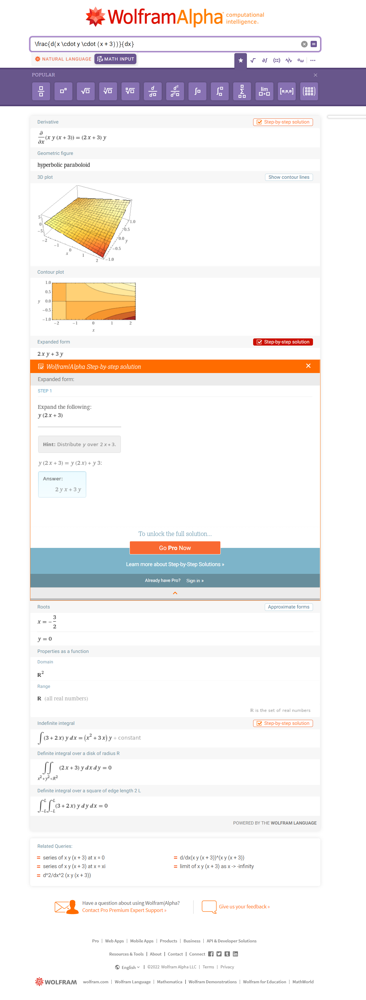

# 2.57

## 练习 2.57 请扩充求导程序，使之能处理任意项（两项或者更多项）的和与乘积。这样，上面的最后一个例子就可以表示为：

```
(deriv '(* x y (+ x 3)) 'x)
```

## 设法通过只修改和与乘积的表示，而完全不修改过程 deriv 的方式完成这一扩充。例如，让一个和式的addend是它的第一项，而其augend是和式中的其余项。

---

先复用一点上一练习的代码：

```eval-scheme
(define (=number? v n)
    (if (number? v)
        (= v n)
        #f
    )
)

(define (error msg v)
    (list msg v)
)

(define variable? symbol?)
(define (same-variable? v1 v2)
    (and (variable? v1) (variable? v2) (eq? v1 v2))
)
(define (make-sum a1 a2) 
    (cond 
        ((=number? a1 0) a2)
        ((=number? a2 0) a1)
        ((and (number? a1) (number? a2)) (+ a1 a2))
        (else (list '+ a1 a2))
    )
)
(define (make-product m1 m2)
    (cond
        ((=number? m1 1) m2)
        ((=number? m2 1) m1)
        ((and (number? m1) (number? m2)) (* m1 m2)) 
        (else (list '* m1 m2))
    )
)
(define (sum? x) (and (pair? x) (eq? (car x) '+)))
(define addend cadr)
(define augend caddr)
(define (product? x) (and (pair? x) (eq? (car x) '*)))
(define multiplier cadr)
(define multiplicand caddr)

(define (deriv exp var)
    (cond 
        ((number? exp) 0)
        ((variable? exp)
            (if (same-variable? exp var) 1 0)
        )
        ((sum? exp)
            (make-sum
                (deriv (addend exp) var)
                (deriv (augend exp) var)
            )
        )
        ((product? exp)
            (make-sum
                (make-product 
                    (multiplier exp)
                    (deriv (multiplicand exp) var)
                )
                (make-product
                    (deriv (multiplier exp) var)
                    (multiplicand exp)
                )
            )
        )
        (else
            (error "unknown expression type -- DERIV" exp)
        )
    )
)

; 期待返回 1
(deriv '(+ x 3) 'x)
```

定义 exponentiation?：

```eval-scheme
(define (exponentiation? exp)
    (and (pair? exp) (eq? (car exp) '**))
)

; 期待返回 true
(exponentiation? '(** x 3))
```

定义 base：

```eval-scheme
(define base cadr)

; 期待返回 x
(base '(** x 3))
```

定义 exponent：

```eval-scheme
(define exponent caddr)

; 期待返回 3
(exponent '(** x 3))
```

定义 make-exponentiation：

```eval-scheme
(define (make-exponentiation m1 m2) (list '** m1 m2))

; 期待返回 (** x 3)
(make-exponentiation 'x 3)
```

增加一个子句后的 deriv：

```eval-scheme

(define (deriv exp var)
    (cond 
        ((number? exp) 0)
        ((variable? exp)
            (if (same-variable? exp var) 1 0)
        )
        ((sum? exp)
            (make-sum
                (deriv (addend exp) var)
                (deriv (augend exp) var)
            )
        )
        ((product? exp)
            (make-sum
                (make-product 
                    (multiplier exp)
                    (deriv (multiplicand exp) var)
                )
                (make-product
                    (deriv (multiplier exp) var)
                    (multiplicand exp)
                )
            )
        )
        ((exponentiation? exp)
            (cond
                ((= (exponent exp) 0) 0)
                ((= (exponent exp) 1) 1)
                (else
                    (make-product
                        (exponent exp)
                        (make-exponentiation 
                            (base exp) 
                            (- (exponent exp) 1)
                        )
                    )
                )
            )
        )
        (else
            (error "unknown expression type -- DERIV" exp)
        )
    )
)

(deriv '(** x 0) 'x)
```

```eval-scheme
; 期待得到 3x^2 的结果
(deriv '(** x 3) 'x)
```

现在尝试直接计算：

$$
\frac{d(x \cdot y \cdot (x + 3))}{dx}
$$

```eval-scheme
(deriv '(* x y (+ x 3)) 'x)
```

得到了一个结果： y，这显然是因为目前的乘法只看到了前两项，于是只计算了： $$\frac{d(y \cdot x)}{dx}$$。

### 现在修改一下和的表示：

```eval-scheme
(define (augend exp)
    (if (<= (length (cddr exp)) 1)
        (caddr exp)
        (cddr exp)
    )
)
 
(define (make-sum addend augend)
    (cond 
        ((=number? addend 0)
             (if (pair? augend)
                (make-sum (car augend) (cdr augend))
                augend
             )
        )
        (
            (or (=number? augend 0) (null? augend)) 
            addend
        )
        ((and (number? addend) (number? augend)) (+ addend augend))
        (
            (and (number? addend) (pair? augend) (number? (car augend)))
            (make-sum (+ addend (car augend)) (cdr augend))
        )
        (else
            (list '+ addend augend)
        )
    )
)

(make-sum 1 (list 2 3 4 5 6))
```

```eval-scheme
(augend '(+ 2 3 4 5 6))
```

### 再来修改一下乘积的表示：

```eval-scheme
(define (make-product m1 m2) 
    (cond
        ((null? m2) m1)
        ((=number? m1 0) 0)
        ((=number? m1 1)
            (if (pair? m2)
                (make-product (cadr m2) (cddr m2))
                m2
            ) 
        )
        ((=number? m2 0) 0)
        ((=number? m2 1) m1)
        ((and (number? m1) (number? m2)) (* m1 m2))
        (
            (and (number? m1) (pair? m2) (number? (car m2)))
            (make-product (* m1 (car m2)) (cdr m2))
        ) 
        (else 
            (if (pair? m2)
                (list '* m1 (make-product (car m2) (cdr m2)))            
                (list '* m1 m2)
            )
        )
    )
)

(define (multiplicand exp) 
    (if (<= (length (cddr exp)) 1)
        (caddr exp)
        (cons '* (cddr exp))
    )
)

(multiplicand '(* 1 2 3 4 5))
```

```eval-scheme
(multiplicand '(* 1 2))
```

```eval-scheme
(make-product 1 (list 2 3 4 5 6))
```

```eval-scheme
(make-sum 'x 3)
```

```eval-scheme
(make-product 'x (list 'y (make-sum 'x 3)))
```

### 再来计算一次：

```eval-scheme
(deriv '(* x 3 5 8) 'x)
```

```eval-scheme
(deriv '(* x y (+ x 3)) 'x)
```

即：

$$
\frac{d(x \cdot y \cdot (x + 3))}{dx} = (x\cdot y) + (y \cdot (x + 3)) = x \cdot y + x\cdot y + 3 \cdot y
$$

### 对比 WolframAlpha 的结果

[](https://www.wolframalpha.com/input?i2d=true&i=%5Cfrac%5C%28123%29d%5C%2840%29x+%5Ccdot+y+%5Ccdot+%5C%2840%29x+%2B+3%5C%2841%29%5C%2841%29%5C%28125%29%5C%28123%29dx%5C%28125%29)