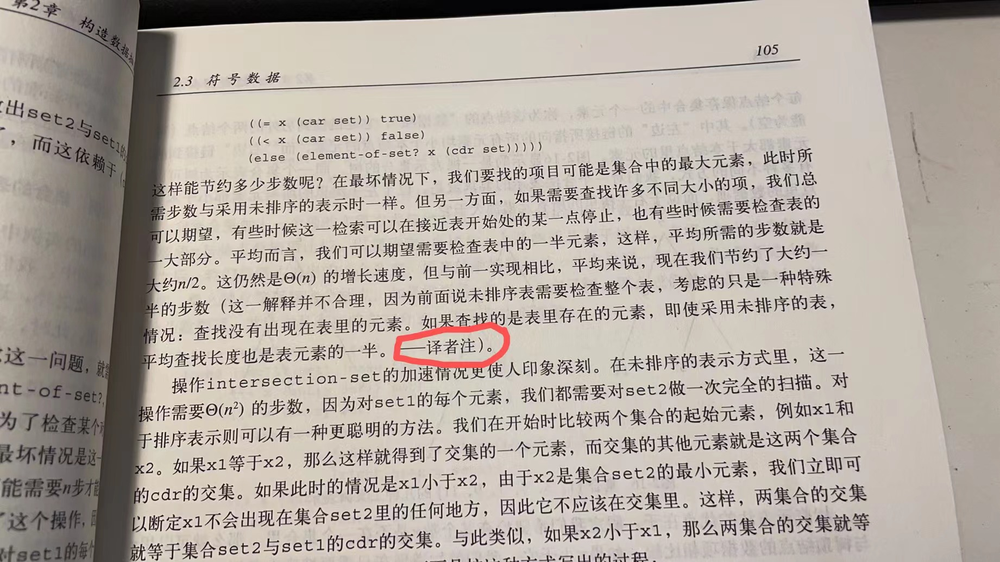

# 2.61

## 练习 2.61 请给出采用排序表示时 adjoin-set 的实现。通过类似element-of-set?的方式说明，可以如何利用排序的优势得到一个过程，其平均所需的步数是采用未排序表示时的一半。

---

```eval-scheme
(define (adjoin-set x set)
    (cond
        ((null? set) (list x))
        ((= x (car set)) set)
        ((< x (car set)) (cons x set))
        (else (cons (car set) (adjoin-set x (cdr set))))
    )
)

(adjoin-set 1 (list 1 2 3 4))
```

在上面的例子中，是最好的情况，只需要一步。

```eval-scheme
(adjoin-set 5 (list 1 2 3 4))
```

而在上面的这一个例子中，是最坏的情况，要插入的元素比所有的元素都大，所以需要 n 步。

平均而言，我们可以期望需要检查表中的一半元素，即平均所需要的步数是 n/2。

而未排序的表，按书中的说法，平均所需要的步数也是 n，那么从这个意义上说，采用排序表后，adjoin-set平均所需要的步数是未排序表示时的一半。

然而，正如裘宗燕指出的那样，如果要插入的元素是随机的，那么即使采用未排序的表，平均查找的长度也是元素个数的一半，即 n/2。



也就是说，对于 adjoin-set，和 element-of-set? 过程一样，采用排序表并没有优势。

如果要有优势，则必需改写 element-of-set? 和 adjoin-set 的实现，即采用二分法，让复杂度从 $$\Theta(n)$$ 降为 $$\Theta(log(n))$$。


