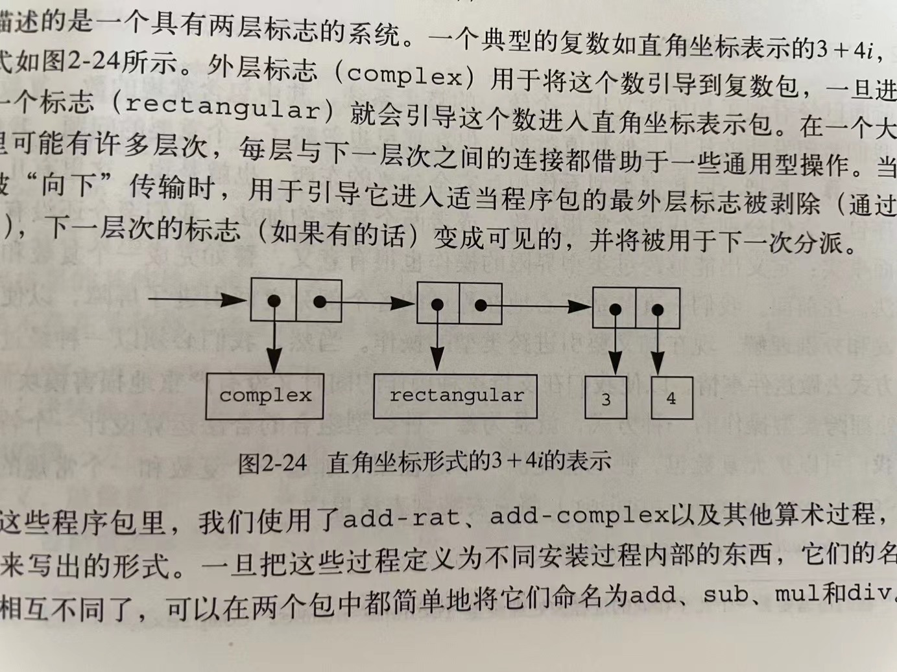

# 2.77

## 练习 2.77 Louis Reasoner 试着去求值 `(magnitude z)`，其中的z就是图2-24里的那个对象。令他吃惊的是，从`apply-generic`出来的不是5而是一个错误信息，说没办法对类型`(complex)`做操作`magnitude`。他将这次交互的情况给Alyssa P. Hacker看，Alyssa说“问题出在没有为`complex`数定义复数选择函数，而只是为`polar`和`rectangular`数定义了它们。你需要做的就是在`complex`包里加入下面这些东西”：

```plain
(put 'real-part '(complex) real-part)
(put 'imag-part '(complex) imag-part)
(put 'magnitude '(complex) magnitude)
(put 'angle '(complex) angle)
```

请详细说明为什么这样做是可行的。作为一个例子，请考虑表达式`(magnitude z)`的求值过程，其中z就是图2-24里展示的那个对象，请追踪一下这一求值过程中的所有函数调用。特别是看看`apply-generic`
被调用了几次？每次调用中分派的是哪个过程？

---



先来测试一下 `apply` 函数：

```eval-scheme
' expect 10
(apply + (list 1 2 3 4))
```

定义一个 `error` 函数：

```eval-scheme
(define (error msg v)
    msg
)
```

然后定义一个 `apply-generic` 函数：

```eval-scheme
(define (apply-generic op . args)
    (let ((type-tags (map type-tags args)))
        (let ((proc (get op type-tags)))
            (if proc
                (apply proc (map contents args))
                (error
                    "No method for these types -- APPLY-GENERIC"
                    (list op type-tags)
                )
            )
        )
    )
)
```

尝试求 `(magnitude z)`:

```eval-scheme
(magnitude z)
```

z 还不存在。如何表示一个复数？先定义一个 `make-complex-from-real-imag` 函数：

```eval-scheme
(define (make-complex-from-real-imag x y)
    ((get 'make-from-real-imag 'complex) x y)
)

(define z (make-complex-from-real-imag 3 4))
```

以上程序并不能直接执行，要能够执行，需要首先安装相应的程序包。要能安装包，需要先实现 `get` 和 `put` 函数。

```eval-scheme
(define helper (js-eval "const table = {}; function get (op, type) {    return table[op][type];} function put (op,type, proc) {    table[op] = table[op] || {};    table[op][type] = proc; } const exports = {get, put, table}; 
exports;"))

(define JSON (js-eval "JSON"))
```

```eval-scheme
(define (get op type)
    (js-invoke helper 'get op type)
)

(define (put op type proc)
    (js-invoke helper 'put op type proc)
)
```

有了 `get` 和 `put` 的支持，就可以写 `install-package` 函数了：

```eval-scheme
(define (install-rectangular-package)
    ;; internal procedures
    (define (real-part z) (car z))
    (define (imag-part z) (cdr z))
    (define (make-from-real-imag x y) (cons x y))
    (define (magnitude z) 
        (sqrt 
            (+ 
                (square (real-part z)) 
                (square (imag-part z))
            )
        )
    )
    (define (angle z) 
        (atan 
            (imag-part z) 
            (real-part z)
        )
    )
    (define (make-from-mag-ang r a) 
        (cons 
            (* r (cos a)) 
            (* r (sin a))
        )
    )

    ;; interface to the rest of the system
    (define (tag x) (attach-tag 'rectangular x))
    (put 'real-part 'rectangular real-part)
    (put 'imag-part 'rectangular imag-part)
    (put 'magnitude 'rectangular magnitude)
    (put 'angle 'rectangular angle)
    (put 'make-from-real-imag 'rectangular 
        (lambda (x y) 
            (tag 
                (make-from-real-imag x y)
            )
        )
    )
    (put 'make-from-mag-ang 'rectangular 
        (lambda (r a) 
            (tag 
                (make-from-mag-ang r a)
            )
        )
    )
    'done
)
```

然后，再求 `(magnitude z)`:

```eval-scheme
(magnitude z)
```

可以看到，现在的 `magnitude` 还是 Scheme 原本的 `magnitude`，如果需要使用我们的包里的 `magnitude`，需要先安装包，然后将它重新定义为我们包里的 `magnitude`：

```eval-scheme
(install-rectangular-package)
(define magnitude (get 'magnitude 'rectangular))
(define imag-part (get 'imag-part 'rectangular))
(define real-part (get 'real-part 'rectangular))

(define (make-complex-from-real-imag x y)
  ((get 'make-from-real-imag 'rectangular) x y)
  )

(define z (make-complex-from-real-imag 3 4))
```