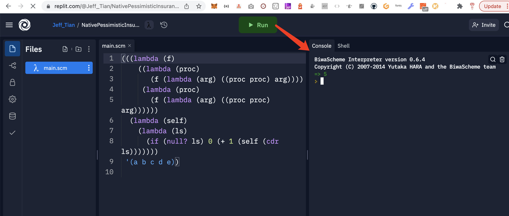

# https://sicp.jiwai.win

> 我在学习《计算机程序的构造与解释》时做的练习

## 缘由

凡是我不能拿来创建的，都是我还没有理解的。

## 学以致用
学习了 SICP，现炒现卖，已经能回答一些知乎上的问题了：
- [怎么理解邱奇计数？ - Jeff Tian的回答 - 知乎](https://www.zhihu.com/question/39930042/answer/2415190431)
- [《计算机程序的构造与解释》、scheme lisp 怎么编出一个可执行的hello world 程序？ - Jeff Tian的回答 - 知乎](https://www.zhihu.com/question/19717660/answer/2416275760)
- [怎么徒手计算正切函数tanx与对数函数的近似值? - Jeff Tian的回答 - 知乎](https://www.zhihu.com/question/520617642/answer/2388416491)

## 一起学习
### 集成环境
现代化的学习工具有很多，首推 replit。

[现代化的学习方式](https://www.zhihu.com/zvideo/1474464781729529857)

### 微信群

我加入了一个 SICP 微信群，你也想加入的话，可以先添加我的微信，我再邀请你进入：

### 也欢迎关注我的订阅号

点击 <a href="https://mp.weixin.qq.com/mp/appmsgalbum?__biz=MzAxNTk3ODgxNA==&action=getalbum&album_id=1679046774696574978&scene=173&from_msgid=2247483677&from_itemidx=1&count=3&nolastread=1#wechat_redirect" target="_blank">链接</a> 可以查看我写的关于 SICP 的文章。

<iframe src="https://mp.weixin.qq.com/mp/appmsgalbum?__biz=MzAxNTk3ODgxNA==&action=getalbum&album_id=1679046774696574978&scene=173&from_msgid=2247483677&from_itemidx=1&count=3&nolastread=1#wechat_redirect" style="border: 0; width: 100%; min-height: 500px">点击跳转</a></iframe>

